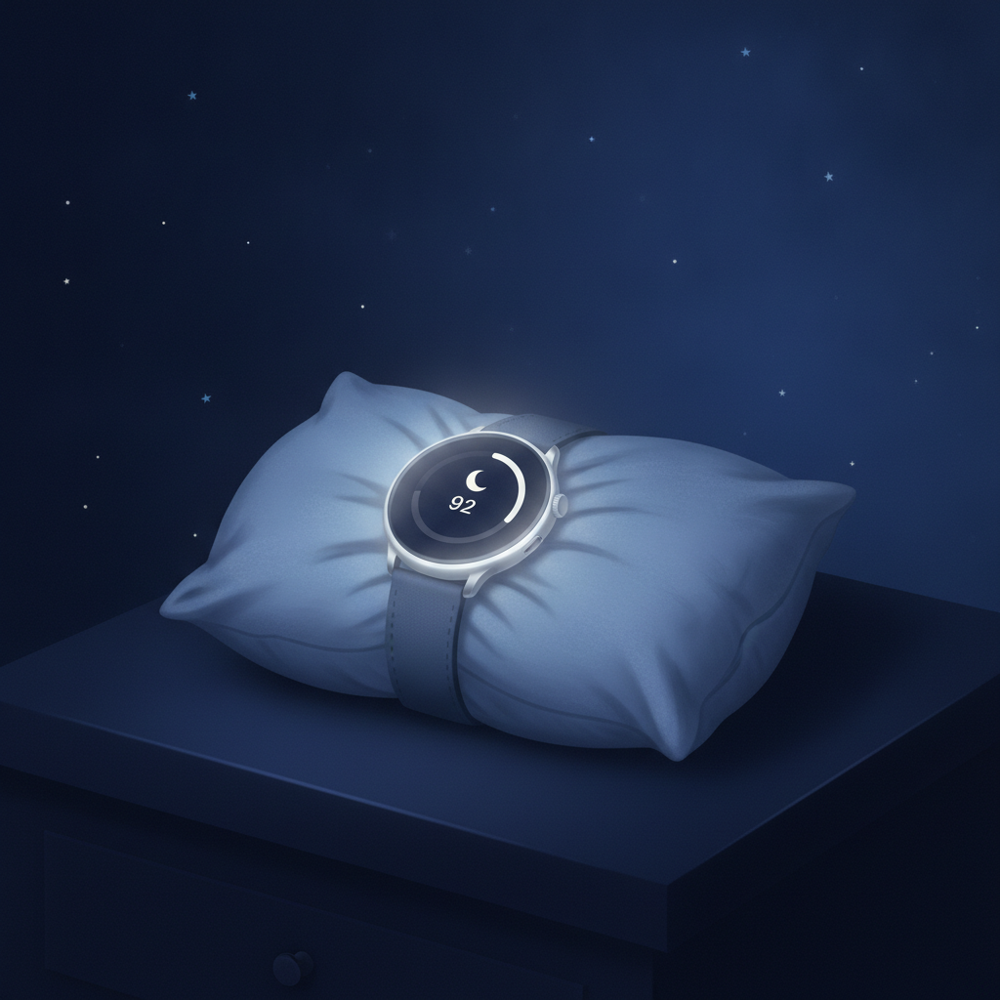

<!--
生成日: 2026-07-25
参考ジャンル: テクノロジー (avg_like_count: 119.2)
note.comへの投稿: 未実施（下書きのみ）
-->

# スマートウォッチの睡眠スコア、結局信じていいの？肩こり会社員が3週間本気で検証してみた

「深い眠り 12%」。

朝、通知を開くたびにそう表示されて、なんとなく肩を落とす。そんな日が続いていた。

去年の冬にスマートウォッチを買ってから、毎朝いちばん最初に見るのが睡眠スコアになった。でも正直なところ、この数字をどこまで信じていいのか、ずっとモヤモヤしていた。今日はその検証の話をしたい。

## きっかけは「数字に振り回される自分」への違和感

きっかけは些細なことだった。

睡眠スコアが良かった日は、なんとなく1日中気分がいい。逆に低かった日は、実際にはそこまで眠くないのに「今日はダメな日」だと決めつけて、仕事の集中力まで下がっていく気がした。

これはさすがにおかしいと思った。腕につけたセンサーの数値ひとつで、1日の調子を自分で決めてしまっている。

そこで、3週間だけ「睡眠スコア」と「実際の体感」を毎朝メモして比較してみることにした。

## やったことはシンプル

やり方は難しくない。

- 起床直後にスマートウォッチのスコアをメモする
- 起床直後の体感を5段階で自己採点する（すっきり度・肩や首のこわばり・仕事への集中しやすさ）
- 前夜の就寝時刻、カフェイン摂取、スマホを見ていた時間もあわせて記録する

これを3週間、なるべく機械的に続けた。

## 見えてきたのは「一致しない日」の多さ

結果としてわかったのは、スコアと体感が一致する日は思ったより少ないということだった。

スコアが70点台でも「今日は絶好調」と感じた日が何度もあった一方で、80点を超えていても、首や肩がガチガチで仕事に全然集中できない日もあった。

とくにズレが大きかったのは、就寝前にスマホを長く見ていた日だ。スコア自体はそこまで悪くないのに、体感としては明らかに寝た気がしない。逆に、就寝前にストレッチをしただけの日は、スコアより体感の方がずっと良かった。

つまりこの数字は「絶対的な体調の答え」ではなく、あくまで「ひとつの傾向を示す参考値」でしかないらしい。

## 数字よりも、記録そのものが効いた

3週間やってみて一番効果を感じたのは、実はスコアの精度そのものではなかった。

「毎朝、自分の体をメモする」という行為自体が、体調の変化に敏感になるきっかけになっていた。スコアが良くても悪くても、まず自分の体に一度目を向ける。その習慣が地味に効いていた気がする。

肩こりも、スコアが低い日を気にするより、就寝前のスマホ時間とストレッチの有無を意識するようになってから、明らかに軽くなった。

## 結論、数字は「きっかけ」でしかない

スマートウォッチの睡眠スコアは、信じすぎる必要も、無視する必要もない。

一喜一憂するための数字ではなく、「今日は少し寝る前の習慣を見直そうかな」と思うための、小さなきっかけとして使うくらいがちょうどいい。

数字に振り回されていた自分に気づけただけでも、この3週間の検証には意味があったと思う。
