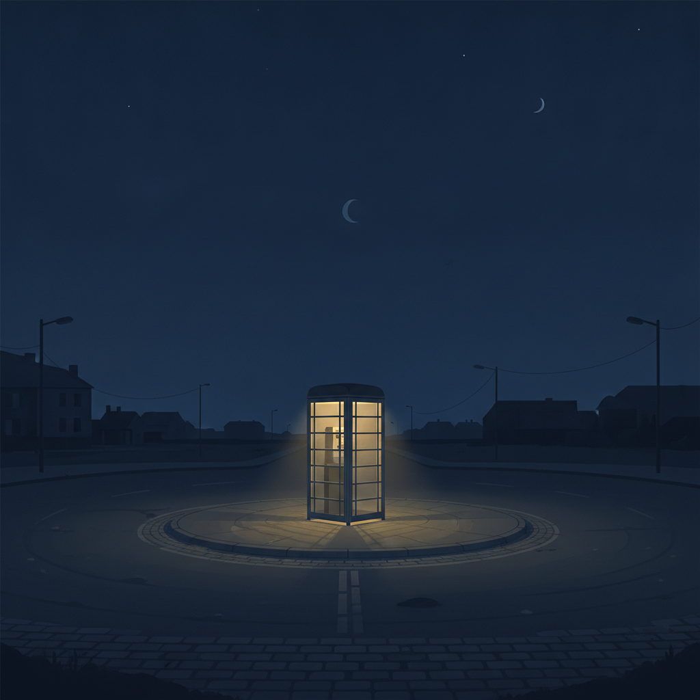

<!--
生成日: 2026-07-26
参考ジャンル: 小説 (avg_like_count: 50.8)
note.comへの投稿: 未実施（下書きのみ）
-->

# 終電を逃した夜に、公衆電話が鳴った

終電を逃したのは、たぶん人生で三度目だった。

改札の向こうでシャッターが下りる音を聞きながら、僕はロータリーの端に立ち尽くしていた。タクシー乗り場には誰もいない。始発まで、あと四時間。

## 誰も使わないはずの箱

駅前のロータリーの隅に、古い公衆電話ボックスがあった。

いつからそこにあるのか誰も知らない、そんな佇まいだった。ガラスは曇り、中の蛍光灯だけが妙に元気よく灯っている。スマホしか持っていない僕にとって、それはもう遺跡のようなものだった。

暇つぶしにボックスに近づいて、受話器を眺めていたときだった。

リィィン。

低く、くすんだ音が鳴った。僕は思わず後ずさった。

もう一度、リィィン。

誰もいない。硬貨も入っていない。回線が生きているはずもない。それなのに、電話は確かに鳴り続けていた。

## 出るべきではない、と分かっていたのに

四度目の呼び出し音で、僕は受話器を取ってしまった。

「……もしもし」

雑音の向こうから、女の人の声がした。歳の見当がつかない、でもどこか懐かしい声だった。

「あ、良かった。つながった」

「あの、番号を間違えていませんか。ここ、もう使われていない電話だと思うんですけど」

「知ってる。だからここにかけたの」

意味が分からなかった。でも不思議と、電話を切る気にはなれなかった。

「昔、この駅で誰かを待ってたことがあってね。約束の時間に来なくて、ずっとこの箱の前で立ってた。もう何十年も前の話」

「……それで」

「あなたも、誰かを待ってるんじゃない？　その顔」

僕はガラス越しの自分の顔を見た。疲れて、少し泣きそうな顔をしていた。自覚はなかった。

## 待っていたのは、たぶん自分自身

「べつに、誰も待ってません。ただ、終電を逃しただけです」

「そう。なら良かった」

女の人はそれだけ言うと、静かに笑ったような気配がした。

「始発、ちゃんと来るから。ここで待ってれば大丈夫よ」

プツリ、と音が途切れた。受話器からは、もう何も聞こえなかった。

僕はしばらく受話器を握ったまま立っていた。それから、そっと元に戻した。

始発まで、あと三時間五十分。

不思議と、さっきまでの苛立ちは消えていた。ロータリーのベンチに座り直して、僕はポケットからスマホを取り出す代わりに、しばらく夜空を見上げていた。

たぶん、待っていたのは終電でも始発でもなく、こんなふうに立ち止まって夜を眺める時間そのものだったのかもしれない。

公衆電話は、それから一度も鳴らなかった。
