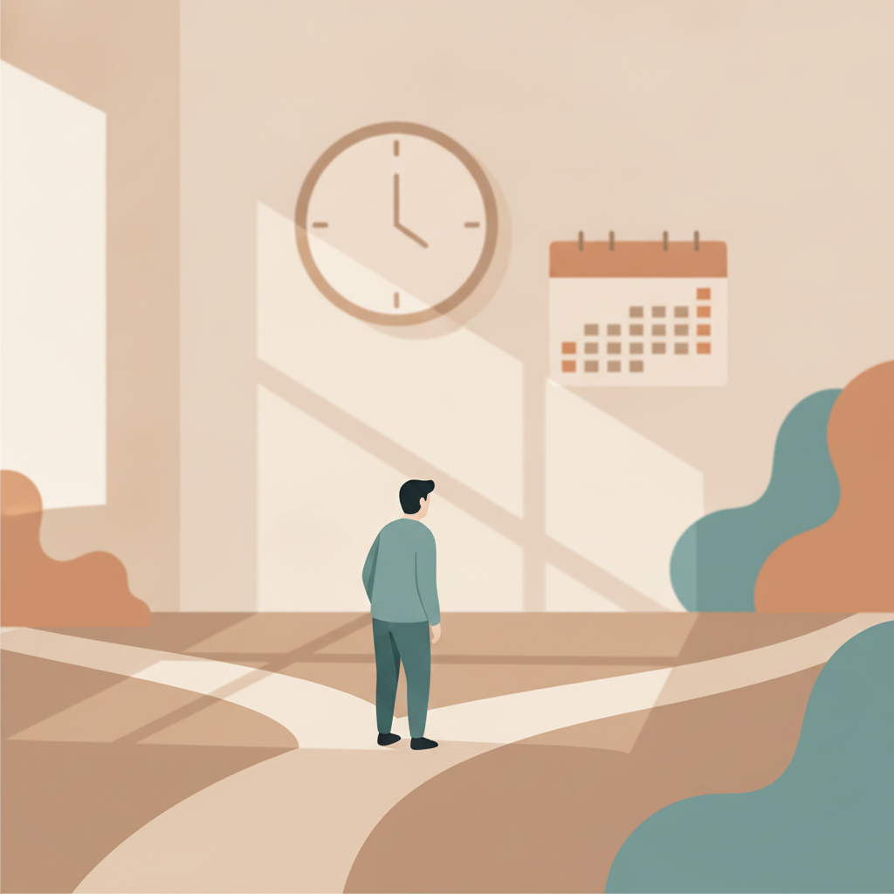

<!--
生成日: 2026-08-02
参考ジャンル: ビジネス (avg_like_count: 112.9)
note.comへの投稿: 未実施（下書きのみ）
-->

# 「様子見です」——その一言が、実は一番高くつく経営判断だった

「もう少し様子を見てから決めましょう」

会議の終わりに、この一言で締めくくられたことが一度もない会社は、たぶん存在しない。誰も反対しないし、誰も傷つかない。むしろ慎重で誠実な判断のように聞こえる。

でも実際のところ、「様子見」はタダではない。ただ、その値札が見えないだけだ。今日はこの、見えないコストの正体について書いてみたい。

## 「様子見」は無料に見える

新しいツールを入れるかどうか。値上げに踏み切るかどうか。人を採るかどうか。こうした判断を先送りにするとき、私たちは「今はまだリスクを取らなかった」と感じる。損はしていない、という感覚だ。

だが、これは半分だけ正しい。目に見える支出はたしかに発生していない。しかし目に見えないところで、時間というもっとも取り返しのつかない資源が確実に減っている。競合はその間に動いているし、市場の条件も変わり続けている。何も選ばないことは、実は「現状維持」という一つの選択を、毎日更新し続けているのと同じことだ。

## 決めないことにも、あとから請求書が届く

先送りにした判断は、消えてなくなるわけではない。たいてい半年後か一年後に、もっと切迫した形で戻ってくる。

値上げを先送りにした会社は、原材料費がさらに上がったタイミングで、一度により大きな値上げを迫られる。人材採用を様子見していた会社は、事業が忙しくなってから慌てて採用を始め、結局は妥協した人選をすることになる。「まだ大丈夫」を積み重ねた先に待っているのは、たいてい選択肢が減った状態での意思決定だ。

これが、様子見という判断の一番厄介なところだと思う。コストは消えたのではなく、利息がついて後払いになっているだけなのだ。

## なぜ様子見は繰り返されるのか

理由は主に三つあると考えている。

一つ目は、失敗の責任は「決めた人」にしか発生しないという構造だ。決めずに現状を維持していれば、少なくとも自分のせいで悪くなったとは言われずに済む。

二つ目は、情報が完璧に揃う日は永遠に来ないという事実を、私たちがつい忘れてしまうことだ。「もう少しデータが集まってから」は、いつまでも次の「もう少し」を呼び込む。

三つ目は、様子見が一見すると誰も傷つけない優しい選択に見えることだ。だが実際には、変化を待っている現場や顧客を、静かに待たせ続けているだけの場合が多い。

## 小さく決める、を積み重ねる

様子見から抜け出す方法は、実はそれほど大げさなものではない。いきなり大きな決断をしなくていい。むしろ、小さく決めて、小さく試すことを繰り返すほうが現実的だ。

値上げなら、全商品を一斉に上げる前に、一部の商品だけ試してみる。新しいツールなら、全社導入の前に一つのチームだけで動かしてみる。小さく決めることを積み重ねていくと、いつの間にか「様子見」よりも「決めて、確かめる」ことのほうが、心理的なハードルが低くなっていく。

## まとめ

「様子見です」は、一見リスクを避けているように聞こえる。でも実際には、目に見えないコストを未来の自分に先送りしているだけのことが多い。

完璧な情報を待つのではなく、小さく決めて、小さく修正する。そのくり返しのほうが、結果として一番コストの低い経営判断になるのではないかと思う。
