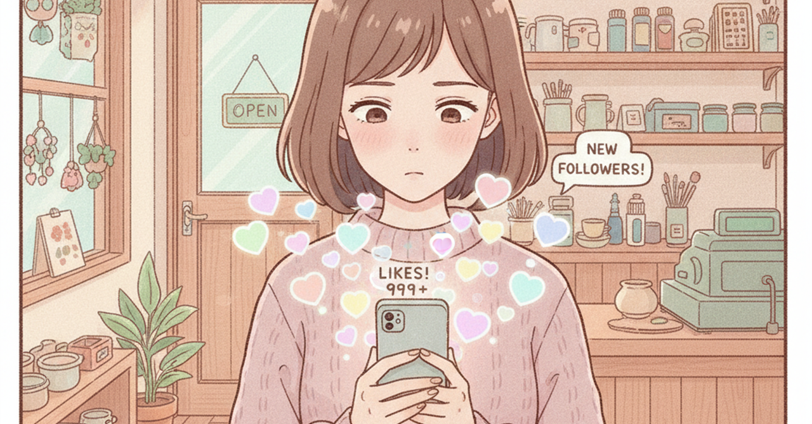

<!--
生成日: 2026-09-03
参考ジャンル: ビジネス (avg_like_count: 152.2)
note.comへの投稿: 未実施（下書きのみ）
-->

# 「いいね」は集まるのに、売れない――その理由

SNSの投稿にいいねが並ぶのに、なぜか来店にも売上にもつながらない。フォロワーは順調に増えているのに、レジの数字だけが変わらない。そんな違和感を抱えている個人事業主や小さな会社の担当者は、実は少なくない。原因は発信量の少なさでも、センスの欠如でもないことが多い。見ている指標と、本当に見るべき指標がずれているだけなのだ。

## 「いいね」が測っているのは、興味であって決断ではない

いいねは、一瞬で押せる。文章を読み終えた直後の「悪くないな」という軽い感情の表明であり、そこに時間もコストもかからない。だからこそ数は集まりやすいが、その裏にある行動の重さはとても軽い。

一方で、実際に店に足を運ぶ、商品を買う、問い合わせをするという行動には、いいねとは比べ物にならない意思決定のコストがかかる。時間を使う、お金を使う、期待が外れるリスクを引き受ける。この二つを同じ「反応」として一緒くたに扱ってしまうと、いいねの数が増えているのに売上が伸びない理由が見えなくなる。

## 「保存」や「見返す」行動のほうが、はるかに本音に近い

SNSの反応の中でも、いいねより保存やブックマーク、二度目の閲覧のほうが、実際の行動意欲に近いとされる。保存するという行為には「あとで使いたい」「もう一度確認したい」という具体的な目的があるからだ。

小さな店や個人の発信でも同じことが起きている。「素敵ですね」というコメントをくれた人と、営業時間やアクセスをわざわざ調べた人とでは、次に取る行動がまるで違う。前者は好意を示しただけで満足しており、後者はすでに来店を検討し始めている。この違いを見分けずに「反応が多い投稿」ばかりを追いかけると、実際の客数にはつながらない発信を量産することになる。

## 好かれることと、選ばれることの間にある溝

いいねが多い投稿は「好かれている」証拠にはなる。しかし「選ばれている」証拠にはならない。好かれることと選ばれることの間には、意外と大きな溝がある。

この溝を埋めるのは、派手さでも更新頻度でもなく、具体性だ。「素敵なお店です」で終わる投稿には行動のきっかけが含まれていないが、「平日14時なら並ばずに入れます」「初めての人はこのメニューが一番人気です」といった具体的な一文が加わった瞬間、読み手の頭の中に次の行動の選択肢が生まれる。感情に訴える発信と、行動を後押しする発信は、似ているようでまったく別の技術なのだ。

## 明日からできる、小さな一歩

大がかりな分析ツールを導入する必要はない。まずは直近の投稿の中から、いいねの数ではなく、保存やクリック、実際の問い合わせにつながった投稿を一つ選び出してみてほしい。

その投稿に共通しているのは何か。日時や場所、価格、対象者など、行動に直結する具体的な情報が入っていないだろうか。逆に、いいねだけが多くて行動につながらなかった投稿には、感情に訴える言葉はあっても、次の一歩を示す情報が抜けていないだろうか。

いいねの数を追いかけるのをやめる必要はない。ただ、それが「好かれている」指標であって「選ばれている」指標ではないことを忘れずにいるだけで、発信の作り方は少しずつ変わっていくはずだ。
