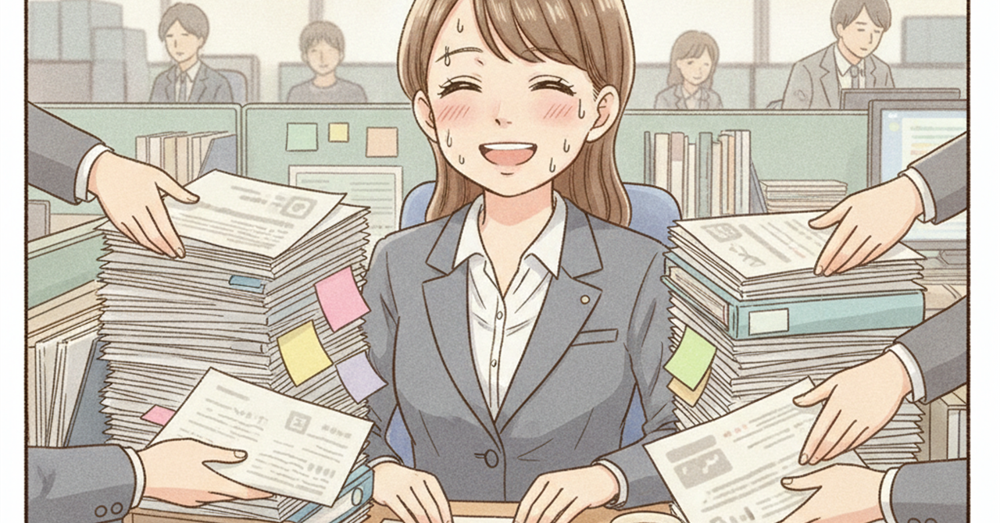

<!--
生成日: 2026-09-06
参考ジャンル: ビジネス (avg_like_count: 44.1)
note.comへの投稿: 未実施（下書きのみ）
-->

# 「頼まれ上手」なのに評価されない人の、ある共通点

「あの人は頼めば何でもやってくれる」。職場でそう言われる人が、なぜか昇進や評価のタイミングで一歩後れを取る。真面目で、誰にでも感じがよく、頼まれごとを断らない。それなのに、なぜか「代えがきく人」として扱われてしまう——そんな逆説について考えてみたい。

## 「頼まれ上手」は美徳だが、キャリアでは罠になる

頼まれごとを快く引き受ける人は、職場で確実に重宝される。急な依頼にも嫌な顔をせず、締切前の応援にもすぐ手を挙げる。この姿勢自体は、間違いなく美徳だ。

問題は、この美徳が積み重なると「何でも屋」というポジションに固定されてしまうことにある。頼む側からすれば、その人に頼めば大抵のことは片付く。だから次も、その次も頼む。本人は感謝されている実感があるし、忙しさは「必要とされている証拠」のようにも感じられる。

しかし、ここに落とし穴がある。「何でもできる人」という評判は、裏を返せば「何か一つを極めた人」という評判にはなりにくい。人事評価や昇進の判断では、後者のほうが圧倒的に説明しやすい。「この分野なら彼／彼女」という一言で通る人材と、「困ったときに助けてくれる人」という説明でしか語られない人材とでは、評価のされ方がまったく違う。

## 忙しさと成果は、別の軸で動いている

多くの職場で、忙しそうにしている人は「頑張っている」と見なされやすい。だが忙しさは、あくまで投入した時間や引き受けた量の指標であって、成果の指標ではない。

頼まれ上手な人ほど、この二つを混同しがちだ。今日も誰かの相談に乗り、資料作成を手伝い、急なトラブル対応にも駆り出された。一日の終わりには確かな疲労感があり、それが「今日はよく働いた」という満足につながる。しかし、その一日で自分の専門性を一段深めるような仕事に、どれだけ時間を使えただろうか。

厄介なのは、この状態が本人にとって心地よいという点だ。頼られることは承認欲求を満たすし、断ることには小さな痛みが伴う。だから多くの人は、意識しないまま「頼まれごとを優先する働き方」に流れていく。気づいたときには、一年、また一年と、自分の専門領域を深める時間が後回しにされ続けている。

## 評価される人がやっている、地味な線引き

一方で、頼まれごとをこなしながらも、きちんと評価を積み上げていく人もいる。彼らを観察すると、派手な工夫ではなく、地味な線引きの習慣が見えてくる。

第一に、引き受ける前に「これは自分にしかできない仕事か」を一瞬だけ自問している。他の人でも対応できる依頼であれば、抱え込まずに割り振るか、簡潔に済ませる方法を提案する。第二に、自分の専門領域に関わる依頼は多少無理をしてでも引き受け、そうでない依頼には期限や範囲を明確に区切って応じる。全否定はしないが、際限なく引き受けもしない。

第三に、そして最も見落とされがちなのが、定期的に「今、自分は何の専門家として見られているか」を振り返る時間を持っていることだ。半年前と比べて、その答えが変わっていなければ、それは危険信号かもしれない。頼まれごとに時間を使いすぎて、自分の軸を深める時間が削られているサインだからだ。

## 「便利な人」から「必要な人」への切り替え方

もし今、頼まれごとに追われる日々に違和感を覚えているなら、すべてを断る必要はない。まずは、自分の一週間の時間の使い方を書き出してみることをお勧めしたい。

「誰かに頼まれてやったこと」と「自分から選んでやったこと」を色分けするだけでいい。前者ばかりが並んでいたら、それは働き方を見直すサインだ。次に、頼まれごとの中から「自分の専門性と重なるもの」を意識的に選び、それ以外は思い切って手放す練習をしてみる。

「頼まれ上手」であること自体は、決して悪いことではない。問題は、その美徳に流され続けた結果、自分が何の専門家なのかを説明できなくなることだ。忙しさに満足する前に、一度立ち止まって、自分の時間が何に使われているかを見直してみてほしい。そこに、次のキャリアを動かす手がかりがあるはずだ。
