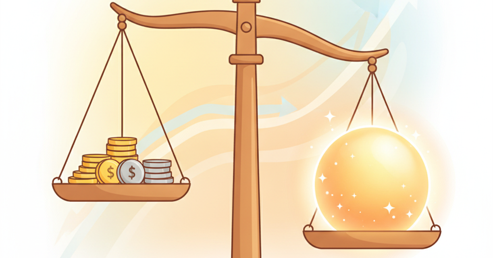

<!--
生成日: 2026-09-06
参考ジャンル: ビジネス (avg_like_count: 33.8)
note.comへの投稿: 未実施（下書きのみ）
-->

# 「安さで選ばれる会社」ほど、なぜ早く潰れるのか

値下げをして注文が増えた。担当者に褒められた。数字だけ見れば、成功だ。

でも半年後、同じ会社が「利益が出ない」と苦しんでいる場面を、何度も見てきた。安さで取った客は、もっと安い会社が現れた瞬間にいなくなる。当たり前のことなのに、現場では驚くほど繰り返される。

## 「安いから選ばれた」は、いちばん脆い理由

価格で選ばれた取引には、ひとつ共通点がある。理由が「価格」しかないということだ。

品質やサービスで選ばれた客は、多少の値上げでは動かない。乗り換えるコストや、慣れた安心感が壁になるからだ。ところが価格だけで来た客にとって、その壁は存在しない。むしろ「もっと安いところはないか」と、常に他社の見積もりを探している状態がデフォルトになる。

つまり価格で取った売上は、いつでも他社に持っていかれる前提の売上だ。積み上げているようで、実は毎月ゼロから積み直している。

## 値下げ競争の先に待っているもの

値下げで一時的にシェアを取れても、競合が黙っているわけがない。相手も値下げで対抗してくる。結果、業界全体の利益率がじわじわ下がっていく。

厄介なのは、この競争には「勝者」がいないことだ。体力のある大手が最後まで生き残るとしても、それは勝利というより消耗戦の生存にすぎない。中小規模の会社ほど、この土俵に上がった時点で不利が決まっている。

それでも値下げに手を出してしまうのは、「今月の数字」が見えやすく、「半年後の顧客構造」が見えにくいからだ。目先の成果が、長期の体力を静かに削っていく。

## 顧客が本当に評価しているのは「価格」ではない

高くても選ばれ続けている会社を観察すると、共通しているのは「価格以外の理由」をはっきり持っていることだ。

対応の速さ、担当者の知識、トラブル時の動き方、細かい要望への柔軟さ。どれも見積書には載らないが、顧客はちゃんと覚えている。そして一度「この会社は安心できる」と感じた顧客は、多少の価格差を気にしなくなる。

逆に言えば、価格でしか差別化できていない会社は、こうした「見積書に載らない価値」をまだ言語化できていないだけかもしれない。実際には持っているのに、伝え方が価格訴求に偏っているケースは意外と多い。

## 「高くても選ばれる」ために、今日からできること

いきなり値上げする必要はない。まず、今の顧客に「なぜうちを選んだのか」を聞いてみることから始められる。

そこで返ってくる答えが「安いから」だけなら、危険信号だ。価格以外の理由を答えてもらえる関係を、少しずつ増やしていく。それは新しいサービスを作ることではなく、すでにやっていることを言葉にして伝えるだけでいい場合も多い。

値段を下げて注文を取るのは簡単だ。難しいのは、値段以外の理由で選ばれる状態をつくること。でも、それができた会社だけが、次の値下げ競争が来ても揺らがずにいられる。

安さで選ばれた売上は、砂の上に積んだ城のようなものだ。心地よく見えても、次の波でどこまで残るかはわからない。
