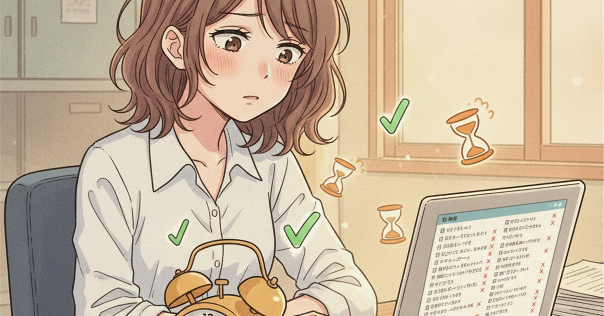

<!--
生成日: 2026-09-08
参考ジャンル: ビジネス (avg_like_count: 161.1)
note.comへの投稿: 未実施（下書きのみ）
-->

# 「時短できたはずなのに、なぜか忙しい」に共通する、見えない仕事の正体

AIツールを導入して、資料作成もメール返信も明らかに速くなった。なのに、定時で帰れる日は増えない。むしろ前より忙しく感じる――そんな声を、あちこちで聞くようになった。作業は確かに時短できているはずなのに、なぜ「楽になった実感」だけが置き去りになるのだろうか。

## 「作業」が減っても、「仕事」は減っていない

ここで見落とされがちなのが、「作業」と「仕事」は別物だということだ。

資料を作る、文章を書く、データを集計する――これらは「作業」であり、AIやツールで確かに短縮できる。しかし仕事には、作業の前後に付随する工程がある。何を作るべきか決める、関係者に確認する、出来上がったものを説明する、反応を見て調整する。これらは「作業」ではなく「調整」であり、AIが肩代わりしにくい部分だ。

作業時間が半分になっても、調整に使う時間はそのまま残る。むしろ、作業が速く終わる分だけ「次はいつ出せるか」という催促のサイクルが早まり、調整の頻度が増えることさえある。時短の恩恵は作業だけに落ち、仕事全体には及んでいない。

## 空いた時間は、静かに「別の仕事」に埋まる

もう一つの見落としは、浮いた時間の使い道だ。

作業が速く終わった分の時間は、多くの場合、休息には回らない。かわりに、後回しにしていた別のタスクが繰り上がってくる。返信を後回しにしていたメール、先延ばしにしていた企画書、いつかやろうと思っていた改善提案。これらが「今ならできる」という理由で、空いた時間にするりと入り込む。

本人の感覚としては「時間ができたから前向きな仕事を増やしただけ」なのだが、外から見れば労働時間も密度も変わっていない。むしろタスクの種類が増えた分、頭の切り替えコストがかさみ、体感的な疲労はむしろ増している。時短ツールは仕事の量を減らすのではなく、こなせる仕事の種類を増やしているだけ、という見方もできる。

## 「忙しさ」は時間ではなく、意思決定の回数で測られている

忙しさの正体をもう少し分解すると、それは「時間の長さ」ではなく「意思決定の回数」に近い。

一日のうちに何度も「これでいいか」「次にどれを優先するか」を判断していると、たとえ作業自体は短時間で終わっていても、脳は休まらない。AIによって作業のスピードが上がるほど、次から次へと判断を求められる場面が増える。ひとつひとつの作業は軽くなったのに、判断の総量はむしろ増えているというのが、多くの現場で起きていることではないか。

つまり「時短できたのに忙しい」という違和感は、勘違いでも贅沢な悩みでもない。仕事の重心が「作業」から「判断」へと移動したことによる、当然の結果だ。

## 見えない仕事を、見える化するところから

この状態を変えるには、まず「作業」と「調整」「判断」を分けて可視化することが有効だ。

一日の終わりに、今日やったことを「手を動かした時間」と「決めたり確認したりした時間」に分けて書き出してみる。それだけで、時短の効果がどこに消えているのかが見えてくる。調整や判断に時間が集中しているなら、そこを減らす工夫――判断基準をあらかじめ決めておく、確認のタイミングをまとめる――のほうが、作業をさらに速くすることよりも効く場合が多い。

時短ツールは魔法ではない。速くなった分の時間をどこに使うかを設計して初めて、忙しさは実際に減っていく。次に「時短できたのに忙しい」と感じたときは、何が速くなって、何がそのまま残っているのかを、一度分けて見てみてほしい。
